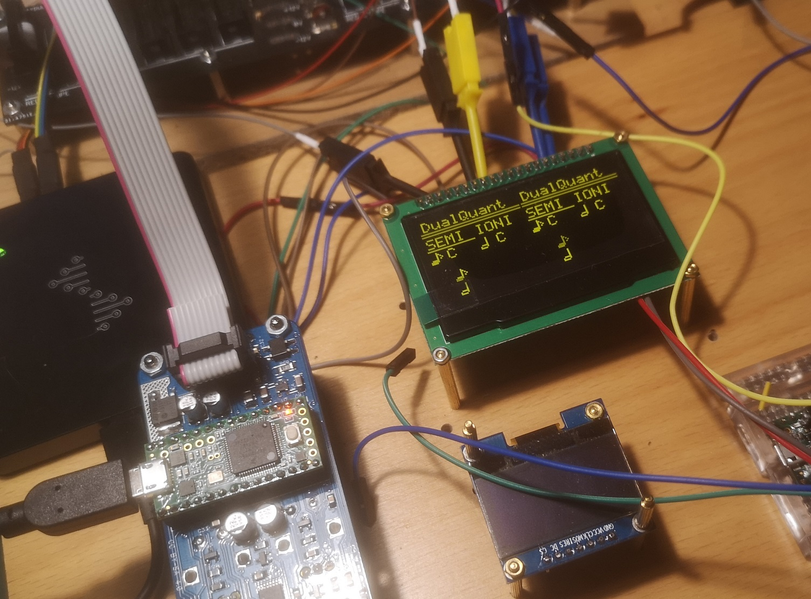
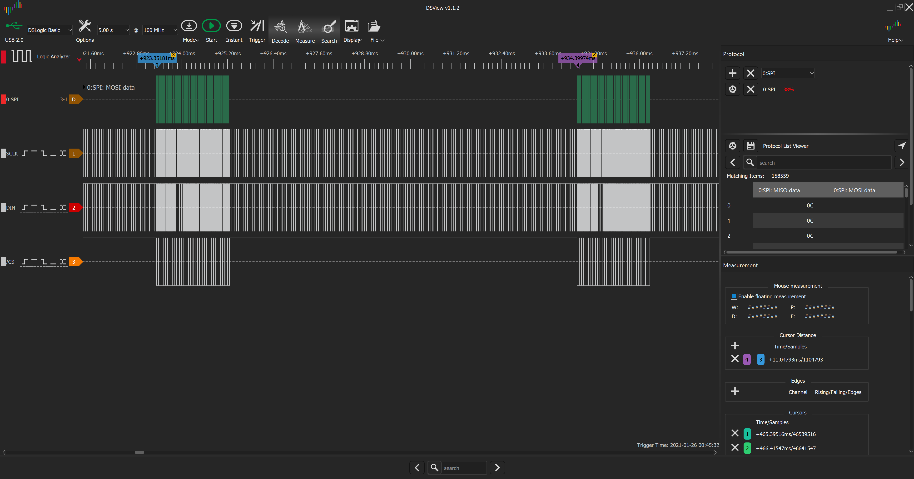
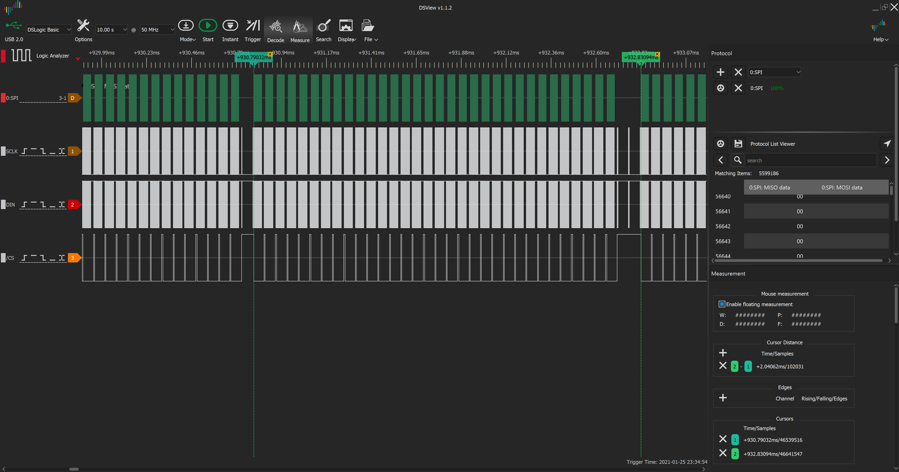
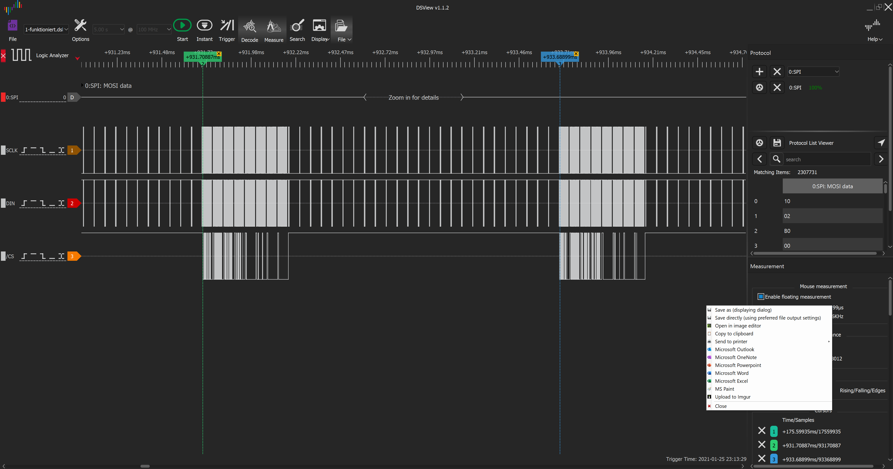

**Experimental branch!!!**

Branched from https://github.com/Logarhythm1/O_C-HemisphereSuite on the 21st of March 2021 (clone, as Github currently does not allow to branch twice within one project tree)

[EastRising's ER-OLEDM-024-2](https://www.buydisplay.com/catalogsearch/advanced/result/?resolution=150&diagonal_size[]=301) does not seem to support more than 10MHz on the serial bus
(according to [datasheet](https://www.buydisplay.com/download/manual/ER-OLED024-2_Series_Datasheet.pdf) & my own tests). If run with the original 30MHz, it will remain black.

So I am dynamically changing the of SPI bus frequency to 8MHz when display data is sent, DAC data is sent with the original 30MHz. The maximum ISR=DAC frequency is at the original 16.67kHz.

Secondly, I split the DMA page transfer (8 pages of 128 bytes per refresh) into 4 sub-pages, so the Teensy sends 8x4x32 bytes instead of 8x128 bytes per refresh. This allows to have a longer display transfer (8MHz is considerably slower than 30MHz), while not affecting the DAC. 

To compensate for additional load on the CPU, I reduced the display refresh rate (REDRAW_TIMEOUT_MS) from 500Hz to 100Hz, which should not be noticeable to the eyes. I am not an embedded developer, however, so please let me know if you see any problems with this approach.

*30/8 MHz SPI, 16kHz DAC, 100Hz display*

*30/8 MHz SPI, 16kHz DAC, 500Hz display*

*Original timing: 30MHz SPI, 16kHz DAC, 500Hz display*

